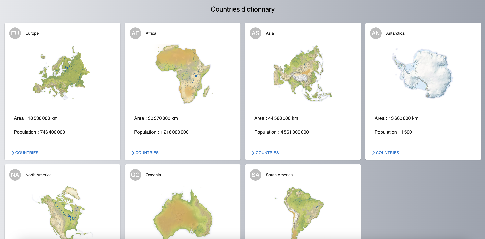

# Countries dictionnary



This repository gives a complete stack about a country dictionnary from the server side to the client side build with GraphQL.
It comes with 2 identical server but one build through apollo-server and the other one with express-graphql.
The client side is build through React.

[Full example of the App here!](https://countries-dictionnary.vercel.app/)

## Summary

- [Countries dictionnary](#countries-dictionnary)
  - [Summary](#summary)
  - [Prerequisites](#prerequisites)
  - [Clone and set variables](#clone-and-set-variables)
  - [Installation](#installation)

## Prerequisites

Please install or have installed the following:

- [git](https://git-scm.com/book/en/v2/Getting-Started-Installing-Git)
- [nodejs](https://nodejs.org/en/download/)
- [yarn](https://yarnpkg.com/getting-started/install) instead of `npm`

## Clone and set variables

1. Clone this repository

```
git clone https://github.com/jrmunchkin/countries-dictionnary-graphql
```

2. Apollo server (apollo-server/.env)

Set the `PORT` where you will run your server (e.g 4000)

Set the `MODE` to `mock` to run the server with mock files. Set it to `db` to run with a MongoDB instance.
To run with a MongoDB instance you first need to create a database on [MongoDB website](https://cloud.mongodb.com/) then set your `MONGO_URL` to link the database.

3. Express server (express-server/.env)

Set the `PORT` where you will run your server (e.g 4000)

Set the `MODE` to `mock` to run the server with mock files. Set it to `db` to run with a MongoDB instance.
To run with a MongoDB instance you first need to create a database on [MongoDB website](https://cloud.mongodb.com/) then set your `MONGO_URL` to link the database.

4. Client (client/.env)

Set the `REACT_APP_GRAPH_URI` corresponding to the uri of one of your servers (e.g http://localhost:4000).

## Installation

1. Run the apollo server

```
cd apollo-server
yarn
yarn dev
```

2. Run the express server

```
cd express-server
yarn
yarn dev
```

3. Run the client side

```
cd client
yarn
yarn start
```
